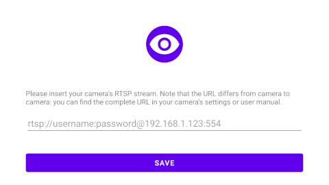
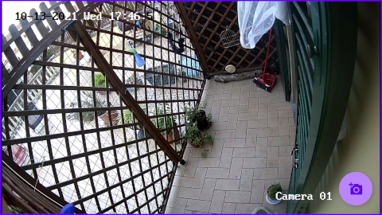
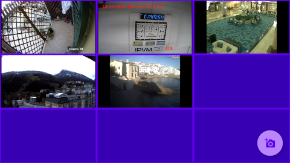

# Ojo: the FLOSS RTSP Surveillance camera viewer for Android

F-droid build **coming soon!**

(Always prefer [F-Droid](https://f-droid.org) build, when possible).

Ojo is a basic IP Camera surveillance wall.
IP camera's RTSP streams are added via its url and shown in the classic tile configuration. The number of tiles is automatically choosen based on the number of configured cameras: a single camera goes full screen, adding more cameras the app switches to a grid view: 2x2, 3x3, 4x4 and so on.
The maximum number of cameras is determined by the device's capabilities.

The stream decoding and rendering is demanded to [VLC's library](https://code.videolan.org/videolan/vlc-android): without their effort this app wouldn't be possible.
This app was specifically developed for F-Droid, as I couldn't find any open source RTSP vievers in the main repository.

            

